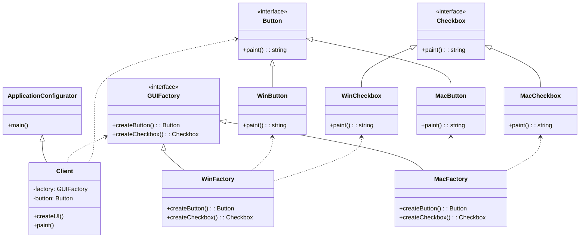

# Abstract Factory Design Pattern

The **Abstract Factory** is a creational design pattern that provides an interface for creating families of related or dependent objects without specifying their concrete classes. It's like a factory that creates other factories.

## 1. Introduction

The primary goal of the Abstract Factory pattern is to isolate client code from the creation of concrete objects. The client interacts with abstract interfaces for both the factories and the products they create. This setup allows you to introduce new variations (or "families") of products without altering the client code.

## 2. When to Use It

Use the Abstract Factory pattern when:
- Your system needs to be independent of how its products are created, composed, and represented.
- You want to provide a library of products, and you want to reveal just their interfaces, not their implementations.
- Your system is configured with one of multiple families of products.
- A family of related product objects is designed to be used together, and you need to enforce this constraint.

## 3. Pros and Cons

| Pros :+1:                                                                                             | Cons :-1:                                                                                                     |
| ----------------------------------------------------------------------------------------------------- | ------------------------------------------------------------------------------------------------------------- |
| **Isolation of Concrete Classes**: The client code is decoupled from concrete product implementations.  | **Complexity**: The pattern introduces many new interfaces and classes, which can increase the code's complexity. |
| **Easy to Exchange Product Families**: You can change the product family by changing the concrete factory. | **Difficult to Add New Products**: Adding a new product type requires modifying the Abstract Factory and all its subclasses. |
| **Promotes Consistency**: Ensures that products from the same family are used together.                |                                                                                                               |
| **Follows SOLID Principles**: Adheres to the Single Responsibility and Open/Closed principles.          |                                                                                                               |

## 4. Structure

The Abstract Factory pattern consists of the following components:

-   **Abstract Factory**: (`GUIFactory`) An interface that declares methods for creating abstract products.
-   **Concrete Factory**: (`WinFactory`, `MacFactory`) Classes that implement the Abstract Factory interface to create a specific family of products.
-   **Abstract Product**: (`Button`, `Checkbox`) Interfaces for a type of product.
-   **Concrete Product**: (`WinButton`, `MacButton`) The actual product objects created by a concrete factory.
-   **Client**: The code that uses the Abstract Factory and Abstract Product interfaces.

### UML Diagram



## 5. PHP Example

Here is a practical implementation of the Abstract Factory pattern in PHP, based on the UI toolkit example.

### Step 1: Define Abstract Products

First, we define the interfaces for the UI elements.

```php
// Abstract Product A
interface Button
{
    public function paint(): string;
}

// Abstract Product B
interface Checkbox
{
    public function paint(): string;
}
```

### Step 2: Create Concrete Products

Next, we create concrete implementations for different operating systems.

```php
// Concrete Products for Windows
class WinButton implements Button
{
    public function paint(): string
    {
        return 'Rendering a button in Windows style.';
    }
}

class WinCheckbox implements Checkbox
{
    public function paint(): string
    {
        return 'Rendering a checkbox in Windows style.';
    }
}

// Concrete Products for macOS
class MacButton implements Button
{
    public function paint(): string
    {
        return 'Rendering a button in macOS style.';
    }
}

class MacCheckbox implements Checkbox
{
    public function paint(): string
    {
        return 'Rendering a checkbox in macOS style.';
    }
}
```

### Step 3: Define the Abstract Factory

Now, we define the factory interface.

```php
// Abstract Factory
interface GUIFactory
{
    public function createButton(): Button;
    public function createCheckbox(): Checkbox;
}
```

### Step 4: Create Concrete Factories

We create concrete factories for each OS.

```php
// Concrete Factory for Windows
class WinFactory implements GUIFactory
{
    public function createButton(): Button
    {
        return new WinButton();
    }

    public function createCheckbox(): Checkbox
    {
        return new WinCheckbox();
    }
}

// Concrete Factory for macOS
class MacFactory implements GUIFactory
{
    public function createButton(): Button
    {
        return new MacButton();
    }

    public function createCheckbox(): Checkbox
    {
        return new MacCheckbox();
    }
}
```

### Step 5: The Client Code

Finally, the client code uses the factory to create UI elements without knowing the concrete classes.

```php
class Application
{
    private GUIFactory $factory;
    private Button $button;

    public function __construct(GUIFactory $factory)
    {
        $this->factory = $factory;
    }

    public function createUI(): void
    {
        $this->button = $this->factory->createButton();
    }

    public function paint(): string
    {
        return $this->button->paint();
    }
}

class ApplicationConfigurator
{
    public function main(): void
    {
        $config = ['os' => 'Windows']; // This could come from a config file
        $factory = null;

        if ($config['os'] === 'Windows') {
            $factory = new WinFactory();
        } elseif ($config['os'] === 'macOS') {
            $factory = new MacFactory();
        } else {
            throw new \Exception("Error! Unknown operating system.");
        }

        $app = new Application($factory);
        $app->createUI();
        echo $app->paint();
    }
}

// Run the application
$configurator = new ApplicationConfigurator();
$configurator->main(); // Outputs: Rendering a button in Windows style.
```